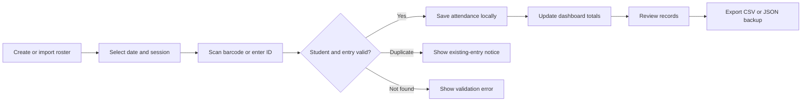
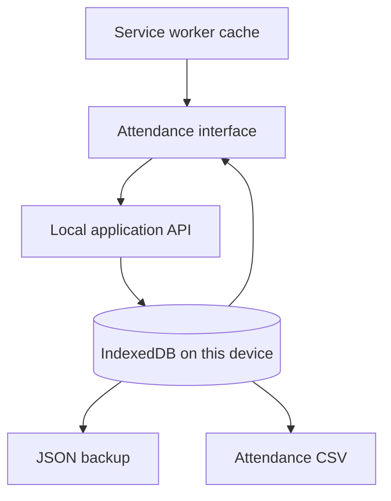

<div align="center">
  

  # HCDC-MSPS Attendance System

  **An installable, offline-first attendance workspace for fast student check-in and dependable local recordkeeping.**

  [](https://react.dev/)
  [](https://www.typescriptlang.org/)
  [](https://vite.dev/)
  [](#installing-the-app)
  [](#license)
</div>

---

## Overview

HCDC-MSPS Attendance is a browser-based Progressive Web App (PWA) designed for managing student rosters and recording attendance by ID number or barcode. The application stores operational data in the browser using IndexedDB, allowing the installed production app to continue working without an internet connection or database server.

The system is organized around four attendance sessions:

- Morning In
- Morning Out
- Afternoon In
- Afternoon Out

Each student can be recorded only once per date and session. Duplicate scans are detected and reported without creating duplicate records.

> [!IMPORTANT]
> Data is local to the current browser profile, device, and site origin. Clearing browser data removes the local workspace. Create regular JSON backups and CSV attendance exports.

## Key features

- **Fast attendance capture** — record students using an eight-digit student ID or assigned barcode.
- **Duplicate protection** — prevent repeated attendance entries for the same student, date, and session.
- **Daily dashboard** — view live totals for all four attendance sessions.
- **Roster management** — add, edit, search, and archive students.
- **Spreadsheet import** — review and import `.xlsx`, `.xls`, or `.csv` masterlists.
- **Import history** — retain summaries and masterlist history after roster changes.
- **Attendance reporting** — search records by date and export spreadsheet-compatible CSV files.
- **Local backup** — download the complete browser workspace as JSON.
- **Offline operation** — reopen the installed production app and use its core features without a network connection.
- **Responsive interface** — use the workspace on desktop, tablet, or mobile screens.

## Application workflow



## Technology stack

| Area | Technology |
| --- | --- |
| Frontend | React 19, TypeScript, Vite 7 |
| Styling | Tailwind CSS 4, Radix UI components |
| Local persistence | IndexedDB |
| Data queries | Local React Query-compatible API layer |
| Spreadsheet processing | SheetJS (`xlsx`) |
| Production host | Express static server |
| Testing | Vitest |
| PWA support | Web app manifest and service worker |

## Getting started

### Prerequisites

- [Node.js](https://nodejs.org/) 20 or later
- Corepack, included with supported Node.js installations
- A Chromium-based browser for the full desktop installation experience

### Installation

```bash
git clone https://github.com/katto-1204/hcdc-msps-attendance.git
cd hcdc-msps-attendance
corepack pnpm install
```

### Development

```bash
npm run dev
```

Open the URL printed in the terminal, normally `http://localhost:3000`. If port `3000` is occupied, the development server automatically selects the next available port.

Development mode supports live reloading but does not register the production service worker. Use a production build to verify installation and offline behavior.

### Production build

```bash
npm run build
npm start
```

Open `http://localhost:3000`, wait for the **Ready for offline use** status, and then install the app if required.

## Using the system

### 1. Add students manually

Open **Students**, choose **Add student**, and provide:

- Student ID: the actual masterlist ID, with any prefix (1–64 characters without spaces)
- First name and/or last name: at least one is required
- Year level: blank when unknown, or a whole number from 1 to 12
- Barcode: optional; defaults to the student ID when omitted

Student IDs and barcodes must be unique, including values belonging to archived students.

### 2. Import a masterlist

Open **Import students** and select a supported spreadsheet. The first worksheet must contain the following column headers:

| Required column | Description |
| --- | --- |
| `CONTROL NO.` | Institutional control number |
| `ID NUMBER` | Actual student ID; any prefix is accepted and leading zeros are preserved |
| `FIRST NAME` | Student's given name |
| `LAST NAME` | Student's family name |
| `MIDDLE NAME` | Student's middle name |
| `HCDC EMAIL` | Institutional email address |
| `PROGRAM` | Academic program |
| `YEAR LEVEL` | Numeric year level |

The format follows `1ST SEM MASTERLIST.xlsx`. All eight headers are required, but middle name, email, program, control number, and year level values may be blank. At least one name and an ID are needed. The first worksheet with matching headers is used; the supplied workbook's duplicate second sheet is not imported again. Footer notes after “nothing follows” are excluded. Empty formatted columns are not scanned.

The app previews the file before import and reports imported, duplicate, and rejected rows. Imports commit locally as a single transaction. Successful imports clear the search and open the student directory, which displays the masterlist details. In Import students, use **Download rejected rows** beside an import to get original values, Excel row numbers, and correction reasons. Correct those values and upload the CSV again. Older imports without saved row details need their source file re-uploaded to generate a report.

### 3. Record attendance

1. Open **Overview**.
2. Select the attendance date.
3. Choose Morning In, Morning Out, Afternoon In, or Afternoon Out.
4. Scan a barcode or enter a student ID.
5. Submit the value to record attendance.

The dashboard updates immediately after a successful entry. Unknown students and duplicate session entries are shown without changing stored records.

### 4. Review and export records

Open **Attendance records** to filter by date, search students, and download a CSV report. CSV exports include the date, timestamp, ID number, student name, year level, and session.

### 5. Back up local data

Choose **Download data backup** in the sidebar to export the complete local workspace as JSON. Store this file securely and create backups regularly, especially before clearing browser data or moving to another device.

## Installing the app

### Chrome or Microsoft Edge

1. Open the production application.
2. Wait until the app reports that it is ready for offline use.
3. Select **Install app** in the interface or use the browser's installation icon/menu.

### iPhone or iPad

1. Open the HTTPS deployment in Safari.
2. Tap **Share**.
3. Select **Add to Home Screen**.

Service workers require HTTPS, except on `localhost`. A plain HTTP address on a local network cannot provide full PWA installation or offline caching.

## Data storage and privacy



- No online account is required for the attendance workspace.
- Student and attendance data is not synchronized automatically between devices.
- Different browsers, profiles, domains, and ports maintain separate data stores.
- Clearing site data removes locally stored roster and attendance information.
- The production service worker caches application assets, including the spreadsheet parser, for offline use.
- Legacy server template modules remain in the repository, but operational attendance data is handled by the browser's local store rather than MySQL.

## Deployment

Build the application before deployment:

```bash
npm run build
```

The deployable web assets are generated in `dist/public`. Serve this directory from an HTTPS-enabled static host for PWA installation. Configure unknown application routes to fall back to `index.html` when the hosting platform requires an explicit single-page application rewrite.

For the included Node.js production server:

```bash
npm start
```

Set `PORT` to choose a preferred port. If it is unavailable, the included server searches for an open port automatically.

## Available scripts

| Command | Purpose |
| --- | --- |
| `npm run dev` | Start the development server with file watching |
| `npm run build` | Build the PWA and bundled production server |
| `npm start` | Serve the production build |
| `npm run check` | Run TypeScript type checking |
| `npm test` | Run the Vitest test suite |
| `npm run format` | Format the project with Prettier |
| `npm run db:push` | Generate and apply legacy Drizzle migrations; not required by the offline workspace |

## Verification

Run the complete project checks before releasing changes:

```bash
npm run check
npm run build
npm test
```

Build before testing because the PWA tests inspect the generated files in `dist/public`. The test suite covers local persistence, validation, duplicate scans, concurrent operations, roster archival/reset behavior, import history, transaction rollback, and offline asset caching.

## Project structure

```text
hcdc-msps-attendance/
├── client/
│   ├── public/              # Icons, manifest, and public assets
│   └── src/
│       ├── components/      # Shared interface components
│       ├── lib/             # Local API and IndexedDB store
│       └── pages/           # Attendance workspace pages
├── server/
│   ├── _core/               # Development and production server infrastructure
│   └── *.test.ts            # Application and offline-behavior tests
├── shared/                  # Shared types and utilities
├── drizzle/                 # Legacy database schema and migrations
├── package.json             # Scripts and dependencies
└── vite.config.ts           # Build and development configuration
```

## Troubleshooting

### The install button is unavailable

Confirm that the app is running from `localhost` or HTTPS and that the browser supports PWA installation. On iOS, use Safari's **Add to Home Screen** action.

### Data is missing on another device or port

This is expected. IndexedDB is isolated by browser profile and origin. Use the same application URL and browser profile, and retain regular backups.

### A student cannot be added or imported

Check that the actual ID is present without spaces, at least one name is provided, the year level is blank or between 1 and 12, and neither the ID nor barcode already belongs to an active or archived student. No prefix restriction applies. Download the rejected-row report from import history for the specific Excel row and reason.

### Attendance is reported as a duplicate

The student has already been recorded for the selected date and session. Choose the correct session or date before scanning again.

### Offline mode is not working during development

This is intentional. Create and serve a production build because the development environment does not register the service worker.

### Dependency installation fails

This repository is configured for pnpm. Install dependencies with:

```bash
corepack pnpm install
```

## Contributing

1. Create a focused feature branch.
2. Make the required changes.
3. Run type checking, the production build, and tests.
4. Submit a pull request describing the behavior changed and how it was verified.

Please do not commit real student records, exported attendance files, backups, credentials, or environment files.

## License

This project is distributed under the MIT License as declared in `package.json`.

---

<div align="center">
  Built for reliable, device-local attendance management.
</div>
